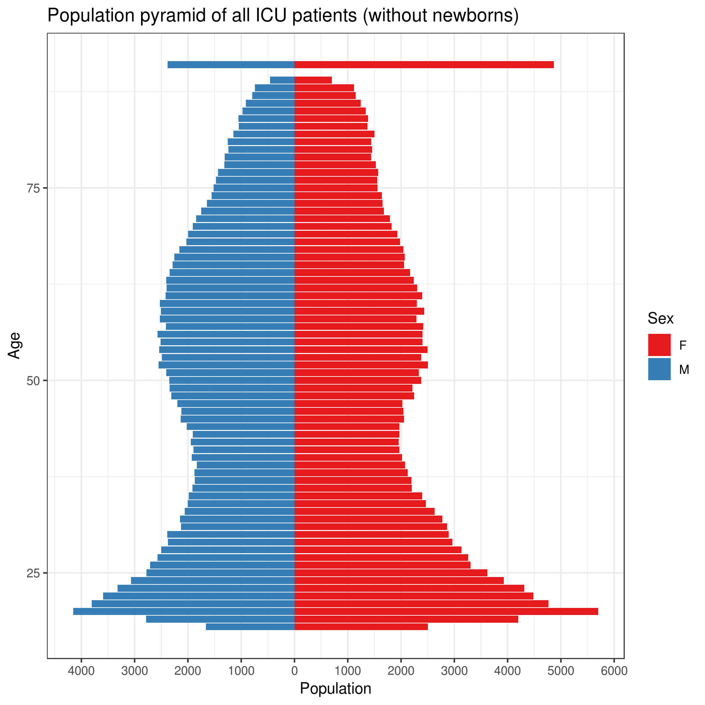
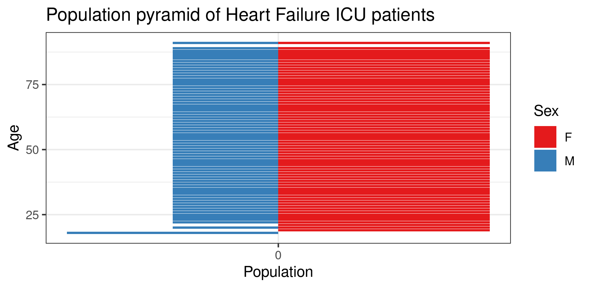

Bios 611-Project 1
================

Proposal: Analysis of MIMIC-4
-----------------------------

### Introduction
Heart failure is a debilitating disease that effects about 6.2 million adults in the US every year, 
according to the CDC. While the risk factors for heart failure are known and have been extensively 
studied, the prevalence of known risk factors are evolving. Additionally, new medications and therapies 
are being introduced all the time. These changes mean that our understanding of what predicts heart 
failure may be changing as well. So what are the *current* drivers of mortality in this population? 

### Dataset
This project uses MIMIC-IV. This is a retrospectively collected datasource containing electronic
health record (EHR) data from Beth Israel Deaconess Medical Center (BIDMC). These data are deidentified
records with information on patient experiences in the ICU. This analysis will use a subset of 
this data restricted to patients who are admitted with a heart failure diagnosis. MIMIC-IV is
an excellent data source to examine the risk factors predicting heart failure since physicians
have more and more been using and relying on their respective EHR systems to document patient diagnostics
and histories. Additionally, this data system has access to all the lab results and procedures that
patients received during their hospitalization.

The data are fairly large, particularly the chart events, so make sure you have sufficient storage
to manipulate this data. You can obtain more information on the data here: 
https://physionet.org/content/mimiciv/0.4/ 
https://mimic-iv.mit.edu/docs/overview/concepts/

Citations:
Johnson, A., Bulgarelli, L., Pollard, T., Horng, S., Celi, L. A., & Mark, R. (2020). MIMIC-IV (version 0.4). 
PhysioNet. https://doi.org/10.13026/a3wn-hq05.

Goldberger, A., Amaral, L., Glass, L., Hausdorff, J., Ivanov, P. C., Mark, R., ... & Stanley, H. E. (2000). 
PhysioBank, PhysioToolkit, and PhysioNet: Components of a new research resource for complex 
physiologic signals. Circulation [Online]. 101 (23), pp. e215–e220.

### Access to data
You will need to request a DUA to access this data. You can use the links above to initiate the process.
Once you have access to the data, pull all datasets from core, icu, and hosp subdirectories into source_data.

Given the size of the data, the primary heart failure dataset will be set-up using sqlite, which is
included in the Dockerfile. Further details are included in the sqlcode folder.
This analysis will be conducted in Rstudio, for which the scripts are included in this git repository.

#### Simulated data
If you do not have access to the dataset, but you want to examine the code using a simulated dataset, you can 
build a report "simreport.tex" using the Makefile. Simdata.R creates simulated datasets in the derived_folder.
You have to build the latex document using make in bash, not inside the Rstudio terminal. The generation of 
this simulated dataset is in progress.

### Preliminary figures
Age and sex among heart failure ICU patients compared with all other ICU patients.

The above figure shows that there are a range of patients captures in this dataset, but most
are older adults.

Most heart failure patients are older adults. Many more individuals in the highest age group (91) are female
than male.

Using This Project
------------------
You will need Docker. You will need to be able to run docker as your current user.

	`docker build . -t project1-env`
	`docker run -v 'pwd':/home/rstudio -p 8787:8787\
		 -e PASSWORD=<yourpassword> -t project1-env`

Then connect to the mahcine on port 8787.

In aliases.sh, there are several aliases to work with the docker file and to set up the git repository.
#### Aliases
Using aliases.sh requires that you have a local secret.sh file with a line in it that defines your passwords.
It should look like this:

	`#!/bin/bash` 
	`export SECRET_PWD=<somepasswordyoucreate>`
Once you have created the local secret.sh file, run:

	> source aliases.sh

Use the below instructions to use the Makefile to make the targets in this repository, primarily the report (report.tex).

If you do not have access to the dataset, but you want to examine the code using a simulated dataset, you can
build a report "simreport.tex" using the Makefile. Simdata.R creates simulated datasets in the derived_folder.
You have to build the latex document using make in bash, not inside the Rstudio terminal.

Makefile
--------
The Makefile included in this repository will help build major components
 of the project. 

For example, to build figures relating to the distribution of ICU visits due to heart failure over 
age and gender, enter via Docker or with Rstudio and say:

	> make figures/hf_age_sex.png

To build the report, you need to build in bash, not Rstudio terminal, using the following:

	> make pdflatex report.tex

You can use alias "b" in aliases.sh to enter a docker instance through bash.

Shiny App
---------
To explore the most commonly prescribed drugs in this dataset, start the R shiny app (shiny_app.R) as follows:
Run RSS:

	> docker run -v `pwd`:/home/rstudio -e PASSWORD=$SECRET_PWD -p 8787:8787 -p 8788:8788 -t shiny

Then run shiny app in Rstudio terminal:

	> PORT=8788 make shiny_app

To run app in another docker instance, contact the author of this repository. 

Python Code
-----------
Aliases.sh is also set up to build a dockter instance for jupyter notebooks ("py"). Once you run this,
you can build the python dependent code. The jupyter notebook script (.ipynb) is converted to python 
script (.py) using the following:

	> ipython nbconvert --to=python [NOTEBOOK_NAME].ipynb

Primary questions
-----------------
The primary question is to identify and characterize features in heart failure 
patients. We will:
	1. Chracterize key demographics of heart failure patients.
	1. Examine demographic information and key medications to identify predictors of mortality
	patient population using logistic regression, LASSO, and elastic net.
	1. Characterize propensity scores for medications identified in the first step using logistic
	regression and random forest models.

Completition criterion
----------------------
I want to understand the heart failure patients in this datasets and identify a preferred method to identify
predictors and to calculate propensity scores. The current status of tihs work is to examine why the logistic
regression classifier has low accuracy. The current theories are that the classifier requires more variables
or logisitic regression is not powerful enough to classify in a setting where the outcome is rare.